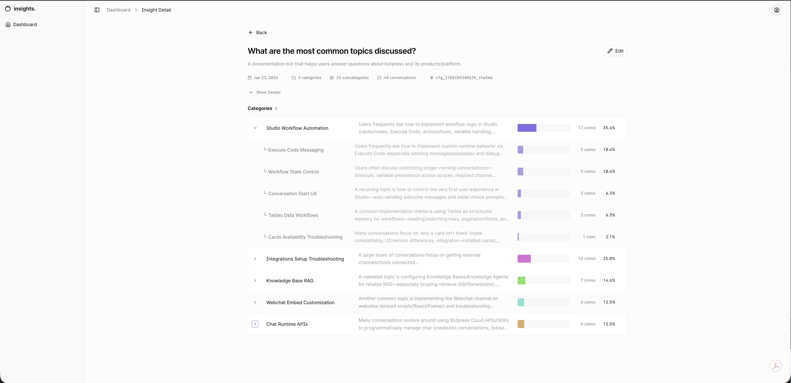

# Insights Agent

[](https://botpress.com/docs/adk)
[](https://react.dev)
[](https://www.typescriptlang.org)



An AI-powered conversation analytics platform that discovers patterns, categorizes user intents, and extracts actionable insights from bot conversations using LLM-based hierarchical analysis.

## What It Does

Insights Agent helps bot developers and product teams answer critical questions about their users:

- **"What are users frustrated about?"**
- **"What topics are users asking about that we don't have content for?"**
- **"What features are users requesting most?"**

It analyzes conversations from your Botpress bot, automatically discovers meaningful categories, and organizes insights into a hierarchical taxonomy—all through natural language configuration.

## Key Features

- **Natural Language Configuration** - Describe your bot and analytical goals in plain English
- **Flexible Sampling** - Stratified sampling by length or date range selection
- **LLM-Based Pattern Discovery** - Automatic category and subcategory discovery using Claude
- **Hierarchical Organization** - Two-level taxonomy (categories → subcategories)
- **Confidence Tracking** - Every assignment includes confidence scores and reasoning
- **Interactive Dashboard** - Explore insights with expandable hierarchies and detailed views

## Architecture

```
┌─────────────────────────────────────────────────────────────────┐
│                         User Dashboard                          │
└────────────────────────────────┬────────────────────────────────┘
                                 │
                                 ▼
┌─────────────────────────────────────────────────────────────────┐
│                      Insights Agent (ADK)                       │
│  ┌─────────────┐  ┌─────────────┐  ┌─────────────────────────┐  │
│  │   Sample    │→ │   Extract   │→ │  Discover & Categorize  │  │
│  │Conversations│  │  Features   │  │  (Categories + Subs)    │  │
│  └─────────────┘  └─────────────┘  └─────────────────────────┘  │
└────────────────────────────────┬────────────────────────────────┘
                                 │
                    ┌────────────┴────────────┐
                    ▼                         ▼
            ┌──────────────┐          ┌──────────────┐
            │  Target Bot  │          │  Claude LLM  │
            │  (analyzed)  │          │  (analysis)  │
            └──────────────┘          └──────────────┘
```

### Tech Stack

| Component | Technologies |
|-----------|--------------|
| **Backend** | Botpress ADK, Node.js, TypeScript |
| **Frontend** | React 19, Vite, Radix UI, Tailwind CSS v4 |
| **AI** | Claude (via Botpress ADK) |
| **Database** | Botpress Tables |

## How It Works

The system operates through a multi-phase pipeline:

1. **Configuration** - Natural language prompts converted to structured config
2. **Sampling** - Stratified or date-range sampling of conversations
3. **Feature Extraction** - LLM extracts intents, topics, outcomes from each conversation
4. **Category Discovery** - LLM discovers natural patterns across all conversations
5. **Hierarchical Assignment** - Conversations assigned to categories and subcategories with confidence scores

## Project Structure

```
insights-agent/
├── bot/                    # Botpress ADK backend
│   ├── src/
│   │   ├── tables/        # Database schemas
│   │   ├── workflows/     # Analysis pipeline phases
│   │   └── utils/         # Sampling, transcripts, API clients
│   └── .env.example
│
├── frontend/              # React dashboard
│   ├── src/
│   │   ├── components/    # UI components
│   │   ├── pages/         # Dashboard, insight detail
│   │   └── services/      # API client
│   └── .env.example
│
└── docs/                  # Additional documentation
```

## Setup

### Prerequisites

- Node.js 18+
- pnpm
- Botpress account with Personal Access Token

### Backend

```bash
cd bot
pnpm install
cp .env.example .env  # Configure your credentials
pnpm dev              # Development mode
```

### Frontend

```bash
cd frontend
pnpm install
cp .env.example .env  # Configure your credentials
pnpm dev              # http://localhost:5173
```

## Usage

1. Open the dashboard
2. Click **Create Insight**
3. Provide natural language inputs:
   - Agent description: *"A customer support bot for a SaaS product"*
   - Analytical question: *"What are the main reasons users contact support?"*
   - Domain context (optional): *"Product features: authentication, billing..."*
4. Run the analysis workflow
5. Explore hierarchical insights in the dashboard

## Why LLM-Based?

Unlike traditional clustering (k-means, DBSCAN), this system:

- **Explainable** - Confidence scores + reasoning for every decision
- **Adaptable** - No training data or feature engineering required
- **Domain-Aware** - Inject domain knowledge via natural language
- **Human-Readable** - Category names and summaries you can understand

---

Built with [Botpress ADK](https://botpress.com/docs/adk)
