# Insights Agent v3

An AI-powered conversation analytics platform built on Botpress that discovers patterns, categorizes user intents, and extracts actionable insights from bot conversations using LLM-based hierarchical analysis.

## What It Does

Insights Agent helps bot developers and product teams answer critical questions about their users:

- **"What are users frustrated about?"**
- **"What topics are users asking about that we don't have content for?"**
- **"What features are users requesting most?"**

It analyzes conversations from your Botpress bot, automatically discovers meaningful categories, and organizes insights into a hierarchical taxonomy—all through natural language configuration.

## Key Features

- **Natural Language Configuration**: Describe your bot and analytical goals in plain English
- **Stratified Sampling**: Intelligent conversation sampling that prevents single-turn bias
- **LLM-Based Pattern Discovery**: Automatic category and subcategory discovery using Claude
- **Hierarchical Organization**: Two-level taxonomy (categories → subcategories)
- **Confidence Tracking**: Every assignment includes confidence scores and reasoning
- **Interactive Dashboard**: Explore insights with expandable hierarchies and detailed views
- **Domain-Aware**: Inject domain knowledge to improve recognition of specialized terminology

## Architecture

### Tech Stack

**Backend (Botpress Agent):**
- Platform: Botpress ADK (Agent Development Kit)
- Runtime: Node.js + TypeScript
- LLM: Claude (via Botpress ADK)
- Database: Botpress Tables (cloud-hosted)
- API: Botpress API

**Frontend:**
- Framework: React 19 + TypeScript
- Build Tool: Vite
- UI: Radix UI + shadcn/ui + Tailwind CSS v4
- Routing: React Router v7

### Project Structure

```
insights-agent-v3/
├── bot/                          # Botpress agent backend
│   ├── src/
│   │   ├── tables/              # Database schema definitions
│   │   ├── workflows/           # Long-running analysis workflows
│   │   │   ├── master-workflow.ts
│   │   │   ├── phase0-config-translation.ts
│   │   │   ├── phase1-sample-conversations.ts
│   │   │   ├── phase2-extract-semantic-features.ts
│   │   │   └── phase3-*.ts     # Category/subcategory discovery & assignment
│   │   └── utils/              # Utilities (sampling, transcripts, API clients)
│   ├── .env                     # Environment variables
│   └── agent.config.ts         # Agent configuration
│
├── frontend/                    # React web application
│   ├── src/
│   │   ├── components/         # UI components
│   │   ├── pages/              # Routes (dashboard, insight detail)
│   │   ├── services/           # API client layer
│   │   └── types/              # TypeScript definitions
│   └── .env                    # Environment variables
│
└── docs/                       # Documentation
    └── sequence-diagram.md     # Insight extraction flow diagram
```

## How It Works

The system operates through a multi-phase pipeline that transforms raw conversations into structured insights:

### Phase 0: Configuration Translation

**Input:** Natural language prompts from user
- Agent description ("What does your bot do?")
- Analytical question ("What insights are you seeking?")
- Domain context (optional, e.g., industry-specific terms)
- Categorization guidance (optional)

**Process:** Claude LLM converts natural language into a structured configuration defining:
- Features to extract (e.g., "product_mentions", "pain_points")
- Custom attributes (categorical, numerical, boolean)
- Clustering focus (what aspect to categorize on)

**Output:** Config saved to database with unique ID

---

### Phase 1: Stratified Conversation Sampling

**Goal:** Get a representative sample of conversations, avoiding over-representation of short/single-turn chats

**Process:**
1. Oversample conversations (3× target sample size)
2. Bucket by length:
   - Single-turn (1 message): Weight 0.5×
   - Short (2-5 messages): Weight 1.0×
   - Medium (6-10 messages): Weight 1.5×
   - Long (11+ messages): Weight 2.0×
3. Calculate proportional distribution based on weights
4. Random sample from each bucket
5. Redistribute remaining quota to high-value buckets

**Output:** List of conversation IDs with stratification statistics

**Why Stratification?** Ensures longer, more informative conversations are adequately represented despite being less frequent.

---

### Phase 2: Semantic Feature Extraction

**Goal:** Extract structured features from each conversation for pattern analysis

**Process (parallel, 10 concurrent):**
1. Fetch messages from target bot API
2. Generate transcript (formatted as "User: ... / Bot: ...")
3. Build dynamic extraction schema from config
4. Extract via LLM:
   - Primary user intent
   - Specific features (config-defined)
   - Conversation outcome (satisfied/unsatisfied/unclear)
   - Key topics
   - Custom attributes (from config)
5. Generate **semantic string** for categorization:
   ```
   Intent: [intent] | Features: {feature1: [values], ...} | Topics: [...] | Outcome: satisfied | Attributes: {...}
   ```
6. Save features + transcript to database

**Output:** Structured features for all conversations

---

### Phase 3: Hierarchical Categorization

Discover and assign a two-level taxonomy: **Categories → Subcategories**

#### 3.1 Discover Top-Level Categories

**Input:** All semantic strings from Phase 2

**Process:**
1. LLM analyzes patterns across all conversations
2. Discovers 2-10 categories (configurable)
3. Each category includes:
   - Name (2-4 words)
   - Summary (how it answers analytical question)
   - Representative conversation indices

**Output:** Categories saved to database

---

#### 3.2 Assign Conversations to Categories

**Process (parallel, 10 concurrent):**
1. LLM reads full transcript for each conversation
2. Evaluates against all discovered categories
3. Returns:
   - Best-fit category
   - Confidence score (0-1)
   - Reasoning (why this category)
4. Calculate category statistics (conversation count, frequency %)

**Output:** Category assignments with confidence tracking

---

#### 3.3 Discover Subcategories

**Process (parallel per category, 5 concurrent):**
1. Filter categories by minimum size (default: 3 conversations)
2. For each qualifying category:
   - Load conversations in category
   - LLM discovers 2-10 subcategories (configurable)
   - Each subcategory represents a more specific pattern
3. Save subcategory hierarchy

**Output:** Subcategories for each category

---

#### 3.4 Assign Conversations to Subcategories

**Process (parallel per category, 3 concurrent):**
1. For each category with subcategories:
   - LLM assigns conversations to best subcategory
   - Returns confidence + reasoning
2. Calculate subcategory statistics (count, frequency within parent)

**Output:** Complete hierarchical taxonomy with assignments

---

### Master Workflow Orchestration

All phases are orchestrated by the `master_workflow` which:
- Executes phases sequentially
- Passes results between phases
- Provides aggregate statistics
- Runs with 4-hour timeout

**Complete Pipeline:**
```
Natural Language Config → Sample Conversations → Extract Features → Discover Categories →
Assign Categories → Discover Subcategories → Assign Subcategories → Dashboard Visualization
```

### Visual Flow Diagram

The following sequence diagram shows the complete interaction flow through all phases:

```mermaid
sequenceDiagram
    actor User
    participant Frontend
    participant Bot as Insights Agent Bot
    participant LLM as Claude LLM
    participant DB as Botpress Tables
    participant TargetBot as Target Bot API

    Note over User,TargetBot: PHASE 0: Configuration Translation

    User->>Frontend: Create Insight<br/>(3 natural language prompts)
    Frontend->>Bot: Trigger config_translation workflow
    activate Bot

    Bot->>LLM: Extract structured config from NL<br/>(agent desc, question, domain, guidance)
    activate LLM
    LLM-->>Bot: Structured config:<br/>- extract_features[]<br/>- attributes[]<br/>- clustering_focus
    deactivate LLM

    Bot->>DB: Save InsightsConfig
    DB-->>Bot: configId
    Bot-->>Frontend: Return configId
    deactivate Bot
    Frontend-->>User: Config created: {configId}

    Note over User,TargetBot: MASTER WORKFLOW TRIGGERED

    User->>Frontend: Run Master Workflow
    Frontend->>Bot: Trigger master_workflow(configId)
    activate Bot

    rect rgb(240, 248, 255)
        Note over Bot,TargetBot: PHASE 1: Sample Conversations

        Bot->>TargetBot: List conversations<br/>(oversample 3× target)
        activate TargetBot
        TargetBot-->>Bot: conversations[] (300 for target of 100)
        deactivate TargetBot

        Note over Bot: Stratified Sampling Algorithm
        Bot->>Bot: 1. Bucket by message count:<br/>   Single(1): 0.5× weight<br/>   Short(2-5): 1.0× weight<br/>   Medium(6-10): 1.5× weight<br/>   Long(11+): 2.0× weight
        Bot->>Bot: 2. Calculate proportions<br/>3. Random sample per bucket<br/>4. Redistribute remaining quota

        loop For each sampled conversation
            Bot->>TargetBot: Get messages(conversationId)
            TargetBot-->>Bot: messages[]
        end

        Bot-->>Frontend: Sample complete:<br/>conversation_ids[]<br/>stratification_stats
    end

    rect rgb(255, 250, 240)
        Note over Bot,LLM: PHASE 2: Extract Semantic Features

        Bot->>DB: Load config
        DB-->>Bot: Config (features, attributes, domain_context)

        par Parallel Processing (concurrency=10)
            loop For each conversation (parallel)
                Bot->>TargetBot: Get messages(conversationId)
                TargetBot-->>Bot: messages[]

                Bot->>Bot: Generate transcript:<br/>"User: message\nBot: message..."

                Bot->>LLM: Extract features:<br/>- primary_user_intent<br/>- specific_features<br/>- conversation_outcome<br/>- key_topics<br/>- custom attributes<br/>(with domain_context)
                activate LLM
                LLM-->>Bot: Extracted features
                deactivate LLM

                Bot->>Bot: Generate semantic_string:<br/>"Intent: [x] | Features: {y} | Topics: [z]..."

                Bot->>DB: Save ConversationFeatures:<br/>- semantic_string<br/>- transcript<br/>- all extracted fields
            end
        end

        Bot-->>Frontend: Extraction complete:<br/>total: N<br/>included: M<br/>excluded: K
    end

    rect rgb(240, 255, 240)
        Note over Bot,LLM: PHASE 3.1: Discover Categories

        Bot->>DB: Load all ConversationFeatures(configId)
        DB-->>Bot: features[] with semantic_strings

        Bot->>Bot: Build context:<br/>"1. Intent: [x] | Features: {...}<br/>2. Intent: [y] | Features: {...}<br/>..."

        Bot->>LLM: Discover N categories<br/>(maxTopLevelCategories=5)<br/>Context: all semantic_strings<br/>Focus: clustering_focus
        activate LLM
        LLM-->>Bot: categories[]:<br/>- name (2-4 words)<br/>- summary (insight)<br/>- representative_indices[]
        deactivate LLM

        loop For each category
            Bot->>DB: Save Category:<br/>- name<br/>- summary<br/>- representative_indices
        end

        Bot-->>Frontend: Categories discovered: N
    end

    rect rgb(255, 240, 245)
        Note over Bot,LLM: PHASE 3.2: Assign to Categories

        Bot->>DB: Load Categories(configId)
        DB-->>Bot: categories[]

        Bot->>DB: Load ConversationFeatures(configId)
        DB-->>Bot: features[] with transcripts

        par Parallel Processing (concurrency=10)
            loop For each conversation (parallel)
                Bot->>LLM: Assign to category:<br/>Transcript: [full_text]<br/>Options: [categories]<br/>Question: analytical_question
                activate LLM
                LLM-->>Bot: Assignment:<br/>- category_index<br/>- confidence (0-1)<br/>- reasoning
                deactivate LLM

                Bot->>DB: Save ConversationCategories:<br/>- category_id<br/>- category_confidence<br/>- category_reasoning
            end
        end

        Bot->>Bot: Calculate category stats:<br/>- conversation_count<br/>- frequency_pct<br/>- avg_confidence

        Bot->>DB: Update Categories (stats)

        Bot-->>Frontend: Assignment complete:<br/>N conversations categorized
    end

    rect rgb(250, 240, 255)
        Note over Bot,LLM: PHASE 3.3: Discover Subcategories

        Bot->>DB: Load Categories(configId)<br/>WHERE count >= minCategorySize
        DB-->>Bot: qualifying_categories[]

        par Parallel per category (concurrency=5)
            loop For each category (parallel)
                Bot->>DB: Load ConversationFeatures<br/>WHERE category_id = X
                DB-->>Bot: features[] (semantic_strings)

                Bot->>LLM: Discover M subcategories<br/>(maxSubcategoriesPerCategory=5)<br/>Context: category semantic_strings<br/>Parent: category_name
                activate LLM
                LLM-->>Bot: subcategories[]:<br/>- name (2-4 words)<br/>- summary (specific insight)<br/>- representative_indices[]
                deactivate LLM

                loop For each subcategory
                    Bot->>DB: Save Subcategory:<br/>- category_id<br/>- name<br/>- summary<br/>- representative_indices
                end
            end
        end

        Bot-->>Frontend: Subcategories discovered:<br/>K total across N categories
    end

    rect rgb(255, 245, 230)
        Note over Bot,LLM: PHASE 3.4: Assign to Subcategories

        Bot->>DB: Load Subcategories(configId)<br/>GROUP BY category_id
        DB-->>Bot: subcategories_by_category{}

        par Parallel per category (concurrency=3)
            loop For each category with subcategories (parallel)
                Bot->>DB: Load ConversationFeatures<br/>WHERE category_id = X
                DB-->>Bot: features[] (transcripts)

                loop For each conversation in category
                    Bot->>LLM: Assign to subcategory:<br/>Transcript: [full_text]<br/>Options: [subcategories]<br/>Parent: category_name
                    activate LLM
                    LLM-->>Bot: Assignment:<br/>- subcategory_index<br/>- confidence (0-1)<br/>- reasoning
                    deactivate LLM

                    Bot->>DB: Update ConversationCategories:<br/>- subcategory_id<br/>- subcategory_confidence<br/>- subcategory_reasoning
                end

                Bot->>Bot: Calculate subcategory stats:<br/>- conversation_count<br/>- frequency_pct (within parent)<br/>- avg_confidence

                Bot->>DB: Update Subcategories (stats)
            end
        end

        Bot-->>Frontend: Assignment complete:<br/>K conversations subcategorized
    end

    Bot-->>Frontend: Master workflow complete:<br/>- conversations_sampled: N<br/>- features_extracted: M<br/>- categories: C<br/>- subcategories: S
    deactivate Bot

    Note over User,TargetBot: VISUALIZATION

    User->>Frontend: View Insights Dashboard
    Frontend->>DB: Fetch all data:<br/>- Config<br/>- Categories<br/>- Subcategories<br/>- Assignments<br/>- Features
    activate DB
    DB-->>Frontend: Complete dataset
    deactivate DB

    Frontend->>Frontend: Render hierarchical view:<br/>- Expandable categories<br/>- Nested subcategories<br/>- Frequency bars<br/>- Confidence indicators

    Frontend-->>User: Interactive insights dashboard

    User->>Frontend: Click category
    Frontend->>DB: Fetch conversations + features<br/>WHERE category_id = X
    DB-->>Frontend: conversations[] with:<br/>- features<br/>- confidence<br/>- reasoning<br/>- transcript

    Frontend-->>User: Category detail sheet:<br/>- Conversations list<br/>- Confidence scores<br/>- Reasoning<br/>- Full transcripts
```



For additional details about each phase, see [docs/sequence-diagram.md](docs/sequence-diagram.md).

## Database Schema

### InsightsConfigsTable
Stores analysis configuration translated from natural language.

| Field | Type | Description |
|-------|------|-------------|
| `key` | string | Config ID (e.g., "cfg_1763068133453_kf7c7") |
| `extract_features` | string[] | Features to extract (e.g., "product_mentions") |
| `attributes` | object[] | Custom attributes (categorical/numerical/boolean) |
| `clustering_focus` | string | What aspect to categorize on |
| `agent_description` | string | What the target bot does |
| `analytical_question` | string | What insights are sought |
| `domain_context` | string? | Optional domain knowledge |
| `categorization_guidance` | string? | Optional categorization hints |
| `created_at` | string | ISO timestamp |

### CategoriesTable
Top-level categories discovered from conversations.

| Field | Type | Description |
|-------|------|-------------|
| `key` | string | Category ID: `${configId}_cat_${index}` |
| `config_id` | string | Reference to config |
| `name` | string | Category name (2-4 words) |
| `summary` | string | Brief explanation (1-2 sentences) |
| `representative_indices` | number[] | Representative conversations |
| `conversation_count` | number | Conversations in category |
| `frequency_pct` | number | % of total conversations |

### SubcategoriesTable
Subcategories within each category.

| Field | Type | Description |
|-------|------|-------------|
| `key` | string | Subcategory ID: `${configId}_cat_${catIdx}_sub_${subIdx}` |
| `config_id` | string | Reference to config |
| `category_id` | string | Parent category ID |
| `name` | string | Subcategory name (2-4 words) |
| `summary` | string | Brief explanation |
| `representative_indices` | number[] | Representative conversations |
| `conversation_count` | number | Conversations in subcategory |
| `frequency_pct` | number | % within parent category |

### ConversationCategoriesTable
Maps conversations to categories/subcategories with confidence.

| Field | Type | Description |
|-------|------|-------------|
| `key` | string | `${configId}_${conversationId}` |
| `config_id` | string | Reference to config |
| `conversation_id` | string | Target bot conversation ID |
| `category_id` | string | Category assignment |
| `category_index` | number | 0-based category index |
| `category_confidence` | number | Confidence (0-1) |
| `category_reasoning` | string | Why this category |
| `subcategory_id` | string? | Optional subcategory |
| `subcategory_index` | number? | 0-based subcategory index |
| `subcategory_confidence` | number? | Confidence (0-1) |
| `subcategory_reasoning` | string? | Why this subcategory |

### ConversationFeaturesTable
Extracted features and semantic representations.

| Field | Type | Description |
|-------|------|-------------|
| `key` | string | Conversation ID |
| `config_id` | string | Reference to config |
| `primary_user_intent` | string | Primary user goal |
| `specific_features` | Record<string, string[]> | Feature mentions |
| `conversation_outcome` | enum | "satisfied" / "unsatisfied" / "unclear" |
| `key_topics` | string[] | Topics discussed |
| `attributes` | Record<string, any> | Custom attribute values |
| `semantic_string` | string | Structured feature representation |
| `transcript` | string | Full conversation transcript |

## Setup

### Prerequisites

- Node.js (v18+)
- pnpm package manager
- Botpress account with:
  - Personal Access Token (PAT)
  - Insights Agent bot created
  - Target bot to analyze

### Backend Setup

1. **Install dependencies:**
   ```bash
   cd bot
   pnpm install
   ```

2. **Configure environment (.env):**
   ```bash
   # Botpress credentials
   PAT=bp_pat_your_token_here
   TARGET_BOT_ID=your_target_bot_id
   TARGET_BOT_WORKSPACE_ID=your_target_workspace_id
   ```

3. **Deploy agent:**
   ```bash
   # Development mode (hot reload)
   pnpm dev

   # Production deployment
   pnpm build
   pnpm deploy
   ```

### Frontend Setup

1. **Install dependencies:**
   ```bash
   cd frontend
   pnpm install
   ```

2. **Configure environment (.env):**
   ```bash
   # Botpress Configuration
   VITE_BOTPRESS_PAT=bp_pat_your_token_here

   # Your Insights Agent bot
   VITE_BOTPRESS_WORKSPACE_ID=wkspace_your_workspace
   VITE_BOTPRESS_BOT_ID=your_insights_bot_id

   # Target bot (being analyzed)
   VITE_TARGET_BOT_WORKSPACE_ID=wkspace_target_workspace
   VITE_TARGET_BOT_ID=your_target_bot_id
   ```

3. **Run development server:**
   ```bash
   pnpm dev
   ```

4. **Build for production:**
   ```bash
   pnpm build
   ```

## Usage

### Creating an Insight

1. Open the dashboard at `http://localhost:5173`
2. Click "Create Insight"
3. Provide natural language inputs:
   - **Agent description:** "A customer support bot for a SaaS product"
   - **Analytical question:** "What are the main reasons users contact support?"
   - **Domain context** (optional): "Product features: authentication, billing, integrations..."
   - **Categorization guidance** (optional): "Focus on user pain points vs feature requests"
4. Wait for config translation (Phase 0)
5. Trigger master workflow to run full analysis
6. Explore hierarchical insights in the dashboard

### Exploring Results

- **Dashboard**: View all insights with stats (categories, conversations, confidence)
- **Insight Detail**: Expandable category/subcategory tree
- **Category Detail**: View conversations, features, confidence scores, reasoning
- **Conversation View**: Read full transcripts with extracted features

## Key Concepts

### Stratified Sampling
Prevents bias toward short conversations by:
- Bucketing by message count
- Applying length-based weights
- Sampling proportionally
- Ensuring diverse conversation types

### LLM-Based Discovery
Unlike traditional clustering (k-means, DBSCAN), this system:
- Uses Claude to discover natural patterns
- Generates human-readable category names and summaries
- Provides explainable confidence scores and reasoning
- Adapts to domain knowledge without retraining

### Confidence Tracking
Every assignment includes:
- **Confidence score** (0-1): How well the conversation fits
- **Reasoning**: Explanation of why this category/subcategory
- Enables filtering and validation of results

### Domain Knowledge Injection
Optional `domain_context` is injected into LLM prompts to:
- Recognize industry-specific terminology
- Understand user segments or personas
- Improve feature extraction accuracy
- Generate more relevant categories

## API Reference

### Key Frontend Services

Located in `frontend/src/services/insights.ts`:

- `createInsight(config)` - Create new insight configuration
- `listConfigs()` - Fetch all insights
- `getConfig(id)` - Get config details
- `getCategories(configId)` - Get categories
- `getSubcategories(configId, categoryId?)` - Get subcategories
- `getConversationCategories(configId)` - Get assignments
- `getConversationFeatures(configId)` - Get extracted features
- `getTopologyStats(configId)` - Calculate aggregate statistics
- `updateConfig(id, updates)` - Update config
- `deleteConfig(id)` - Delete insight and all data
- `getConversation(conversationId)` - Fetch conversation from target bot
- `getMessages(conversationId)` - Fetch messages from target bot

## Troubleshooting

### "No conversations found"
- Verify `TARGET_BOT_ID` and `TARGET_BOT_WORKSPACE_ID` are correct
- Ensure target bot has conversation history
- Check PAT has access to target workspace

### "Workflow timeout"
- Large conversation samples (>200) may exceed 4-hour timeout
- Reduce `maxConversations` parameter
- Check for API rate limiting issues

### "Low confidence scores"
- Provide more detailed `domain_context`
- Add `categorization_guidance` to hint at expected patterns
- Ensure conversations have sufficient content (avoid single-turn)

### "Categories too broad/narrow"
- Adjust `maxTopLevelCategories` (2-10)
- Adjust `maxSubcategoriesPerCategory` (0-10)
- Refine `clustering_focus` in config translation

## Design Decisions

### Why LLM-Based Instead of Traditional ML?
- **Explainability**: Confidence scores + reasoning for every decision
- **Adaptability**: No training data or feature engineering required
- **Domain-Aware**: Inject domain knowledge via natural language
- **Human-Readable**: Category names and summaries are understandable
- **Flexibility**: Works across any domain without retraining

### Why Hierarchical (Categories → Subcategories)?
- **Progressive Detail**: Start broad, drill down into specifics
- **Manageable Scale**: Top-level categories provide overview
- **Actionable Insights**: Subcategories reveal nuanced patterns
- **Flexible Depth**: Can skip subcategories if not needed

### Why Semantic Strings + Full Transcripts?
- **Semantic strings**: Structured, concise representations for pattern discovery
- **Full transcripts**: Rich context for accurate assignment decisions
- **Two-stage approach**: Discovery on summaries, assignment on details

## Contributing

This is a research/internal project. For questions or issues, please contact the development team.

## License

Proprietary - Botpress ADK Application

---

Built with [Botpress ADK](https://botpress.com/docs/adk) and Claude AI
