# Insights Agent

[](https://botpress.com/docs/adk)
[](https://react.dev)
[](https://www.typescriptlang.org)

An AI-powered conversation analytics platform that discovers patterns, categorizes user intents, and extracts actionable insights from bot conversations using LLM-based hierarchical analysis.


## The Problem

You have thousands of bot conversations. Somewhere in there are the answers to critical questions:

- *"What are users frustrated about?"*
- *"What topics are we missing content for?"*
- *"What features are users requesting?"*

Traditional approaches require manually reading transcripts, building keyword rules, or training ML models on labeled data. **Insights Agent takes a different approach**: describe what you're looking for in plain English, and let an LLM discover the patterns for you.

## How It Works

The system operates through a sophisticated **multi-phase pipeline** that transforms raw conversations into structured, hierarchical insights:

```mermaid
flowchart TB
    subgraph Input[" "]
        NL[/"Natural Language Prompts<br/>Agent description, analytical question,<br/>domain context, categorization guidance"/]
    end

    subgraph Pipeline["Processing Pipeline"]
        P0["⚙️ <b>Config Translation</b><br/>LLM converts natural language<br/>into structured extraction schema"]
        P1["📊 <b>Stratified Sampling</b><br/>Bucket by message count, weight by<br/>informativeness, proportional selection"]
        P2["🔍 <b>Feature Extraction</b><br/>Parallel LLM extracts intents, topics,<br/>outcomes → generates semantic strings"]
        P3a["🗂️ <b>Category Discovery</b><br/>LLM analyzes all semantic strings<br/>to find natural patterns"]
        P3b["✅ <b>Hierarchical Assignment</b><br/>Assign conversations to categories<br/>and subcategories with confidence"]
    end

    subgraph Output[" "]
        Results[/"Hierarchical Insights<br/>Categories → Subcategories<br/>Confidence scores + LLM reasoning"/]
    end

    NL --> P0
    P0 -->|Structured Config| P1
    P1 -->|Sampled Conversations| P2
    P2 -->|Semantic Strings| P3a
    P3a -->|Discovered Taxonomy| P3b
    P3b --> Results
```



### Phase 0: Natural Language → Structured Config

Describe your analysis in plain English. The LLM translates this into a structured extraction schema.

<p align="center">
  
</p>

Configure exactly what to extract and how to categorize:

| Tab | Purpose |
|-----|---------|
| **Basic Info** | Analytical question, agent description, clustering focus |
| **Features** | What signals to extract (product mentions, error types, etc.) |
| **Attributes** | Custom dimensions (categorical, boolean, numerical) |
| **Workflow** | Sampling mode, sample size, category limits |
| **Advanced** | Domain context, categorization guidance |

<p align="center">
  
  <br/>
  
  
</p>

### Phase 1: Intelligent Sampling

Not all conversations are equally informative. The stratified sampler prevents bias toward short, uninformative exchanges:

```mermaid
flowchart TD
    A[Fetch 5× target conversations] --> B[Bucket by message count]
    B --> C1[Single-turn: 0.5× weight]
    B --> C2[Short 2-5: 1.0× weight]
    B --> C3[Medium 6-10: 1.5× weight]
    B --> C4[Long 11+: 2.0× weight]
    C1 --> D[Proportional sampling]
    C2 --> D
    C3 --> D
    C4 --> D
    D --> E[Diverse, informative sample]
```



### Phase 2: Parallel Feature Extraction

For each conversation, the LLM extracts structured features—running **10 concurrent extractions** for throughput:

- **Primary user intent** - What was the user trying to accomplish?
- **Specific features** - Product mentions, error types, sentiment signals
- **Conversation outcome** - Satisfied, unsatisfied, or unclear
- **Key topics** - What subjects were discussed?
- **Custom attributes** - Domain-specific dimensions you define

Each conversation gets a **semantic string**—a compressed representation optimized for pattern discovery:

```
Intent: [configure webhooks] | Features: {errors: [timeout], products: [API]} | Topics: [integration, debugging] | Outcome: unsatisfied
```

<p align="center">
  
</p>

### Phase 3: Hierarchical Categorization

This is where it gets interesting. The LLM analyzes all semantic strings to **discover natural categories**—not predefined buckets, but patterns that actually exist in your data.


**Category Discovery:**
- Analyzes patterns across all conversations
- Generates 2-10 top-level categories
- Each category includes a name (2-4 words) and summary

**Subcategory Discovery:**
- For each category with sufficient conversations
- Discovers more specific patterns within
- Creates a two-level hierarchy for drill-down

**Assignment with Confidence:**
- Every conversation assigned with a **confidence score** (0-1)
- LLM provides **reasoning** for each assignment
- Enables filtering low-confidence assignments for review

<br clear="right"/>

### The Dashboard

Explore your insights through an interactive hierarchy:

- **Expandable categories** with conversation counts and frequency percentages
- **Color-coded confidence bars** showing assignment quality
- **Drill-down to subcategories** for granular patterns
- **Full conversation view** with extracted features and LLM reasoning

<p align="center">
  
</p>

## Architecture

```mermaid
flowchart TB
    subgraph Frontend[React Dashboard]
        UI[Radix UI + Tailwind CSS v4]
        Pages[Dashboard / Insight Detail / Conversation View]
    end

    subgraph Backend[Insights Agent - Botpress ADK]
        Workflows[Workflow Engine<br/>master_workflow • 4hr timeout]
        Tables[(5 Table Schemas)]
        Utils[Sampling • Transcripts • API Client]
    end

    subgraph External[External Services]
        Target[Target Bot<br/>Conversations]
        LLM[Claude LLM<br/>Analysis]
    end

    Frontend <-->|Botpress Client SDK| Backend
    Backend <--> Target
    Backend <--> LLM
```



### Tech Stack

| Layer | Technologies |
|-------|--------------|
| **Frontend** | React 19, Vite, Radix UI, shadcn/ui, Tailwind CSS v4, React Router v7 |
| **Backend** | Botpress ADK, Node.js, TypeScript |
| **AI** | Claude (via Botpress ADK) |
| **Database** | Botpress Tables (5 table schemas) |
| **Processing** | Parallel workflows, stratified sampling, semantic string generation |

## Key Design Decisions

### Why LLM-Based Instead of Traditional ML?

| Aspect | Traditional (k-means, DBSCAN) | LLM-Based (This System) |
|--------|------------------------------|------------------------|
| **Setup** | Feature engineering, embeddings, tuning | Natural language description |
| **Output** | Cluster IDs (Cluster 0, 1, 2...) | Human-readable names + summaries |
| **Explainability** | Centroid distances | Confidence scores + reasoning |
| **Domain adaptation** | Retrain on new data | Inject context via prompt |
| **Cold start** | Needs labeled data | Works immediately |

### Why Semantic Strings?

Instead of running LLM categorization on raw transcripts (expensive, noisy), we:
1. **Extract** structured features first (Phase 2)
2. **Compress** into semantic strings for pattern discovery
3. **Use full transcripts** only for final assignment (accuracy matters there)

This gives us the best of both worlds: efficient pattern discovery + accurate assignment.

### Why Hierarchical (Categories → Subcategories)?

- **Progressive detail**: Start broad ("Integration Issues"), drill into specifics ("OAuth Token Expiration")
- **Manageable scale**: 5-10 top categories, each with 3-5 subcategories
- **Actionable granularity**: Subcategories are specific enough to act on

## Project Structure

```
insights-agent/
├── bot/                          # Botpress ADK backend
│   ├── src/
│   │   ├── tables/              # 5 database schemas
│   │   │   ├── configs.ts       # Analysis configurations
│   │   │   ├── categories.ts    # Discovered categories
│   │   │   ├── subcategories.ts # Nested subcategories
│   │   │   ├── features.ts      # Extracted conversation features
│   │   │   └── assignments.ts   # Category assignments + confidence
│   │   ├── workflows/           # Multi-phase pipeline
│   │   │   ├── master-workflow.ts
│   │   │   ├── phase0-config-translation.ts
│   │   │   ├── phase1-sample-*.ts
│   │   │   ├── phase2-extract-semantic-features.ts
│   │   │   └── phase3-*.ts      # Discovery + assignment
│   │   └── utils/
│   │       ├── sampling.ts      # Stratified sampling algorithm
│   │       ├── transcripts.ts   # Conversation formatting
│   │       └── api-client.ts    # Target bot API
│   └── .env.example
│
├── frontend/                    # React dashboard
│   ├── src/
│   │   ├── components/         # Hierarchical UI components
│   │   ├── pages/              # Dashboard, insight detail, conversation view
│   │   └── services/           # Botpress client integration
│   └── .env.example
│
└── docs/                        # Sequence diagrams, API docs
```

## Setup

### Prerequisites

- Node.js 18+
- pnpm
- Botpress account with Personal Access Token

### Backend

```bash
cd bot
pnpm install
cp .env.example .env  # Add your PAT and target bot credentials
pnpm dev              # Development mode with hot reload
```

### Frontend

```bash
cd frontend
pnpm install
cp .env.example .env  # Add your credentials
pnpm dev              # http://localhost:5173
```

## Usage

1. **Create an Insight** - Describe your bot and what you want to learn
2. **Configure Extraction** - Define features, attributes, and workflow parameters
3. **Run Analysis** - The pipeline samples, extracts, discovers, and assigns
4. **Explore Results** - Navigate the category hierarchy, drill into conversations
5. **Iterate** - Adjust domain context or guidance, re-run for refined insights

---

Built with [Botpress ADK](https://botpress.com/docs/adk)
