# Insight Extraction Sequence Diagram

This diagram shows the complete flow of how the Insights Agent v3 extracts and categorizes insights from bot conversations.

## Overview

The system operates through 5 main phases:
1. **Phase 0**: Config Translation (Natural Language → Structured Config)
2. **Phase 1**: Stratified Conversation Sampling
3. **Phase 2**: Semantic Feature Extraction
4. **Phase 3.1-3.2**: Category Discovery & Assignment
5. **Phase 3.3-3.4**: Subcategory Discovery & Assignment

## Complete Sequence Diagram

```mermaid
sequenceDiagram
    actor User
    participant Frontend
    participant Bot as Insights Agent Bot
    participant LLM as Claude LLM
    participant DB as Botpress Tables
    participant TargetBot as Target Bot API

    Note over User,TargetBot: PHASE 0: Configuration Translation

    User->>Frontend: Create Insight<br/>(3 natural language prompts)
    Frontend->>Bot: Trigger config_translation workflow
    activate Bot

    Bot->>LLM: Extract structured config from NL<br/>(agent desc, question, domain, guidance)
    activate LLM
    LLM-->>Bot: Structured config:<br/>- summary_prompt<br/>- extract_features[]<br/>- attributes[]<br/>- clustering_focus
    deactivate LLM

    Bot->>DB: Save InsightsConfig
    DB-->>Bot: configId
    Bot-->>Frontend: Return configId
    deactivate Bot
    Frontend-->>User: Config created: {configId}

    Note over User,TargetBot: MASTER WORKFLOW TRIGGERED

    User->>Frontend: Run Master Workflow
    Frontend->>Bot: Trigger master_workflow(configId)
    activate Bot

    rect rgb(240, 248, 255)
        Note over Bot,TargetBot: PHASE 1: Sample Conversations

        Bot->>TargetBot: List conversations<br/>(oversample 3× target)
        activate TargetBot
        TargetBot-->>Bot: conversations[] (300 for target of 100)
        deactivate TargetBot

        Note over Bot: Stratified Sampling Algorithm
        Bot->>Bot: 1. Bucket by message count:<br/>   Single(1): 0.5× weight<br/>   Short(2-5): 1.0× weight<br/>   Medium(6-10): 1.5× weight<br/>   Long(11+): 2.0× weight
        Bot->>Bot: 2. Calculate proportions<br/>3. Random sample per bucket<br/>4. Redistribute remaining quota

        loop For each sampled conversation
            Bot->>TargetBot: Get messages(conversationId)
            TargetBot-->>Bot: messages[]
        end

        Bot-->>Frontend: Sample complete:<br/>conversation_ids[]<br/>stratification_stats
    end

    rect rgb(255, 250, 240)
        Note over Bot,LLM: PHASE 2: Extract Semantic Features

        Bot->>DB: Load config
        DB-->>Bot: Config (features, attributes, domain_context)

        par Parallel Processing (concurrency=10)
            loop For each conversation (parallel)
                Bot->>TargetBot: Get messages(conversationId)
                TargetBot-->>Bot: messages[]

                Bot->>Bot: Generate transcript:<br/>"User: message\nBot: message..."

                Bot->>LLM: Extract features:<br/>- primary_user_intent<br/>- specific_features<br/>- conversation_outcome<br/>- key_topics<br/>- custom attributes<br/>(with domain_context)
                activate LLM
                LLM-->>Bot: Extracted features
                deactivate LLM

                Bot->>Bot: Generate semantic_string:<br/>"Intent: [x] | Features: {y} | Topics: [z]..."

                Bot->>DB: Save ConversationFeatures:<br/>- semantic_string<br/>- transcript<br/>- all extracted fields
            end
        end

        Bot-->>Frontend: Extraction complete:<br/>total: N<br/>included: M<br/>excluded: K
    end

    rect rgb(240, 255, 240)
        Note over Bot,LLM: PHASE 3.1: Discover Categories

        Bot->>DB: Load all ConversationFeatures(configId)
        DB-->>Bot: features[] with semantic_strings

        Bot->>Bot: Build context:<br/>"1. Intent: [x] | Features: {...}<br/>2. Intent: [y] | Features: {...}<br/>..."

        Bot->>LLM: Discover N categories<br/>(maxTopLevelCategories=5)<br/>Context: all semantic_strings<br/>Focus: clustering_focus
        activate LLM
        LLM-->>Bot: categories[]:<br/>- name (2-4 words)<br/>- summary (insight)<br/>- representative_indices[]
        deactivate LLM

        loop For each category
            Bot->>DB: Save Category:<br/>- name<br/>- summary<br/>- representative_indices
        end

        Bot-->>Frontend: Categories discovered: N
    end

    rect rgb(255, 240, 245)
        Note over Bot,LLM: PHASE 3.2: Assign to Categories

        Bot->>DB: Load Categories(configId)
        DB-->>Bot: categories[]

        Bot->>DB: Load ConversationFeatures(configId)
        DB-->>Bot: features[] with transcripts

        par Parallel Processing (concurrency=10)
            loop For each conversation (parallel)
                Bot->>LLM: Assign to category:<br/>Transcript: [full_text]<br/>Options: [categories]<br/>Question: analytical_question
                activate LLM
                LLM-->>Bot: Assignment:<br/>- category_index<br/>- confidence (0-1)<br/>- reasoning
                deactivate LLM

                Bot->>DB: Save ConversationCategories:<br/>- category_id<br/>- category_confidence<br/>- category_reasoning
            end
        end

        Bot->>Bot: Calculate category stats:<br/>- conversation_count<br/>- frequency_pct<br/>- avg_confidence

        Bot->>DB: Update Categories (stats)

        Bot-->>Frontend: Assignment complete:<br/>N conversations categorized
    end

    rect rgb(250, 240, 255)
        Note over Bot,LLM: PHASE 3.3: Discover Subcategories

        Bot->>DB: Load Categories(configId)<br/>WHERE count >= minCategorySize
        DB-->>Bot: qualifying_categories[]

        par Parallel per category (concurrency=5)
            loop For each category (parallel)
                Bot->>DB: Load ConversationFeatures<br/>WHERE category_id = X
                DB-->>Bot: features[] (semantic_strings)

                Bot->>LLM: Discover M subcategories<br/>(maxSubcategoriesPerCategory=5)<br/>Context: category semantic_strings<br/>Parent: category_name
                activate LLM
                LLM-->>Bot: subcategories[]:<br/>- name (2-4 words)<br/>- summary (specific insight)<br/>- representative_indices[]
                deactivate LLM

                loop For each subcategory
                    Bot->>DB: Save Subcategory:<br/>- category_id<br/>- name<br/>- summary<br/>- representative_indices
                end
            end
        end

        Bot-->>Frontend: Subcategories discovered:<br/>K total across N categories
    end

    rect rgb(255, 245, 230)
        Note over Bot,LLM: PHASE 3.4: Assign to Subcategories

        Bot->>DB: Load Subcategories(configId)<br/>GROUP BY category_id
        DB-->>Bot: subcategories_by_category{}

        par Parallel per category (concurrency=3)
            loop For each category with subcategories (parallel)
                Bot->>DB: Load ConversationFeatures<br/>WHERE category_id = X
                DB-->>Bot: features[] (transcripts)

                loop For each conversation in category
                    Bot->>LLM: Assign to subcategory:<br/>Transcript: [full_text]<br/>Options: [subcategories]<br/>Parent: category_name
                    activate LLM
                    LLM-->>Bot: Assignment:<br/>- subcategory_index<br/>- confidence (0-1)<br/>- reasoning
                    deactivate LLM

                    Bot->>DB: Update ConversationCategories:<br/>- subcategory_id<br/>- subcategory_confidence<br/>- subcategory_reasoning
                end

                Bot->>Bot: Calculate subcategory stats:<br/>- conversation_count<br/>- frequency_pct (within parent)<br/>- avg_confidence

                Bot->>DB: Update Subcategories (stats)
            end
        end

        Bot-->>Frontend: Assignment complete:<br/>K conversations subcategorized
    end

    Bot-->>Frontend: Master workflow complete:<br/>- conversations_sampled: N<br/>- features_extracted: M<br/>- categories: C<br/>- subcategories: S
    deactivate Bot

    Note over User,TargetBot: VISUALIZATION

    User->>Frontend: View Insights Dashboard
    Frontend->>DB: Fetch all data:<br/>- Config<br/>- Categories<br/>- Subcategories<br/>- Assignments<br/>- Features
    activate DB
    DB-->>Frontend: Complete dataset
    deactivate DB

    Frontend->>Frontend: Render hierarchical view:<br/>- Expandable categories<br/>- Nested subcategories<br/>- Frequency bars<br/>- Confidence indicators

    Frontend-->>User: Interactive insights dashboard

    User->>Frontend: Click category
    Frontend->>DB: Fetch conversations + features<br/>WHERE category_id = X
    DB-->>Frontend: conversations[] with:<br/>- features<br/>- confidence<br/>- reasoning<br/>- transcript

    Frontend-->>User: Category detail sheet:<br/>- Conversations list<br/>- Confidence scores<br/>- Reasoning<br/>- Full transcripts
```



## Key Flow Details

### Phase 0: Configuration Translation
- **Input**: 3 natural language prompts
- **Output**: Structured config defining features, attributes, clustering focus
- **LLM Model**: Claude (best available)
- **Purpose**: Convert user intent into machine-actionable schema

### Phase 1: Stratified Sampling
- **Why Oversample?** To get better distribution across message lengths
- **Why Weight?** To prevent single-turn bias and prioritize informative conversations
- **Buckets**: 4 tiers based on message count
- **Algorithm**: Proportional sampling with quota redistribution

### Phase 2: Feature Extraction
- **Parallel Processing**: 10 concurrent conversations
- **Dynamic Schema**: Built from config at runtime
- **Semantic String**: Compact representation for pattern discovery
- **Transcript**: Full text preserved for assignment accuracy
- **Domain Injection**: Optional domain_context improves extraction

### Phase 3.1: Category Discovery
- **Input**: All semantic strings (numbered list)
- **Context Window**: Entire dataset at once
- **Output**: 2-10 categories with representative examples
- **Framing**: Categories as insights, not descriptions

### Phase 3.2: Category Assignment
- **Parallel Processing**: 10 concurrent conversations
- **Input**: Full transcript (not just semantic string)
- **Output**: Best category + confidence + reasoning
- **Post-Processing**: Calculate category statistics

### Phase 3.3: Subcategory Discovery
- **Parallel Processing**: 5 concurrent categories
- **Input**: Semantic strings within each category
- **Filter**: Only categories with ≥3 conversations
- **Output**: 2-10 subcategories per category

### Phase 3.4: Subcategory Assignment
- **Parallel Processing**: 3 concurrent categories
- **Input**: Full transcripts within each category
- **Output**: Best subcategory + confidence + reasoning
- **Update**: Partial update to existing ConversationCategories records

## Performance Considerations

- **Total LLM Calls**: ~2 + N + 1 + N + C + N
  - 1 for config translation
  - 1 for category discovery
  - N for feature extraction (parallel)
  - N for category assignment (parallel)
  - C for subcategory discovery (parallel)
  - N for subcategory assignment (parallel within category)

- **Bottlenecks**:
  - Phase 2: Feature extraction (N LLM calls)
  - Phase 3.2: Category assignment (N LLM calls)
  - Phase 3.4: Subcategory assignment (N LLM calls)

- **Optimizations**:
  - Parallel processing with concurrency limits
  - Rate limiting to prevent API throttling
  - Stratified sampling reduces N
  - Semantic strings for discovery (cheaper than full transcripts)

- **Timeouts**:
  - Individual workflows: 5-60 minutes
  - Master workflow: 240 minutes (4 hours)

## Data Dependencies

```
InsightsConfig (Phase 0)
   ├── Used by: All phases
   │
   ├── ConversationFeatures (Phase 2)
   │   ├── Used by: Phase 3.1, 3.2, 3.3, 3.4
   │   └── Contains: semantic_string, transcript, features
   │
   ├── Categories (Phase 3.1)
   │   ├── Used by: Phase 3.2, 3.3
   │   ├── Updated by: Phase 3.2 (stats)
   │   │
   │   └── Subcategories (Phase 3.3)
   │       ├── Used by: Phase 3.4
   │       └── Updated by: Phase 3.4 (stats)
   │
   └── ConversationCategories (Phase 3.2)
       └── Updated by: Phase 3.4 (subcategory fields)
```

## Error Handling

- **Workflow Retries**: MaxAttempts = 2 per step
- **Rate Limiting**: Automatic retry with backoff
- **Partial Failures**: Step.map() aggregates errors
- **Timeout Handling**: 240-minute master workflow timeout

## Future Enhancements

Commented in codebase but not yet implemented:

- **Active Learning Loop** (Phase 3.1):
  - Sample conversations per discovered category
  - Verify fit and coverage
  - Iteratively refine categories
  - Discover edge cases

- **Confidence Thresholding**:
  - Filter low-confidence assignments
  - Flag conversations for manual review
  - Adaptive category discovery

- **Incremental Updates**:
  - Add new conversations without full reanalysis
  - Update categories based on new patterns
  - Track drift over time

---

**Related Documentation**: [Main README](../README.md)
